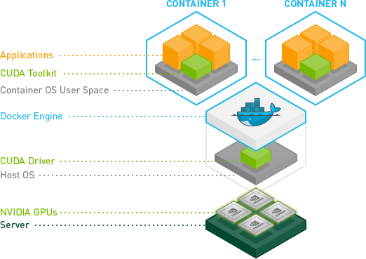

# Docker avec un gpu nvidia / cuda

> **cible**: debian ou windows/macos (avec docker desktop)
> **versions**: debian12, docker 24.0.5, nvidia-driver 560.35.05-1, nvidia-container-toolkit 2.13.0-1, cuda-toolkit-12-8

## détection d'un GPU avant installation

#### see vga cards

* **Debian** `lspci -nn | egrep -i "3d|display|vga"`
* **Windows** : gestionnaire de périphériques

#### nvidia-detect

* **Debian**: `sudo dpkg -i nvidia-detect_{version:-535.247.01-1}~deb12u1_amd64.deb`

## :dart: INSTALLER LES DRIVERS

> Nous avons besoin des drivers nvidia sur l'hôte
> Ainsi que le "Nvidia container toolkit"
> utiliser ces drivers dans un contneur et utiliser le(s) gpu(s)
> [ici](https://github.com/NVIDIA/nvidia-container-toolkit)



> NEEDS nvidia driver on the host

### :one: installer nvidia-driver (debian12 / root)

* :bulb: pour installer une version spécifique du driver, on peut utiliser un fichier de préférences apt

```bash
# in /etc/apt/preferences.d/nvidia-drivers
Package: *nvidia*
Pin: version 560.35.05-1
Pin-Priority: 1001

Package: cuda-drivers*
Pin: version 560.35.05-1
Pin-Priority: 1001

Package: libcuda*
Pin: version 560.35.05-1
Pin-Priority: 1001

Package: libxnvctrl* 
Pin: version 560.35.05-1
Pin-Priority: 1001

Package: libnv*
Pin: version 560.35.05-1
Pin-Priority: 1001
```

* `apt update && apt install nvidia-driver nvidia-smi`

### :two: installer Cuda drivers (debian12 / root)

```bash
wget https://developer.download.nvidia.com/compute/cuda/repos/debian12/x86_64/cuda-keyring_1.1-1_all.deb
## works for the version above
dpkg -i cuda-keyring_1.1-1_all.deb
apt-get update
sudo apt-get -y install cuda-toolkit-12-8
apt-get install -y cuda-drivers
```

* :bulb: `reboot`
* `nvidia-sim`

### :three: installer nvidia-container-toolkit (debian12/root)

```bash
curl -fsSL https://nvidia.github.io/libnvidia-container/gpgkey | sudo gpg --dearmor -o /usr/share/keyrings/nvidia-container-toolkit-keyring.gpg \
  && curl -s -L https://nvidia.github.io/libnvidia-container/stable/deb/nvidia-container-toolkit.list | \
    sed 's#deb https://#deb [signed-by=/usr/share/keyrings/nvidia-container-toolkit-keyring.gpg] https://#g' | \
    sudo tee /etc/apt/sources.list.d/nvidia-container-toolkit.list
apt-get update
apt-get install -y nvidia-container-toolkit
```

* :bulb: ajouter le nvidia runtime pour docker dans `/etc/docker/daemon.json`
```json
{
  "runtimes": {
    "nvidia": {
      "path": "nvidia-container-runtime",
      "runtimeArgs": []
    }
  },
  "default-runtime": "nvidia"
}
```
* then: `systemctl restart docker`

### :four: test

```bash
docker run --rm --gpus all nvidia/cuda:12.8.1-base-ubuntu24.04 nvidia-smi`
nvidia-smi [--query-gpu=uuid --format csv]`
# ex: usage
nvidia-smi -q -d utilization -l
```
