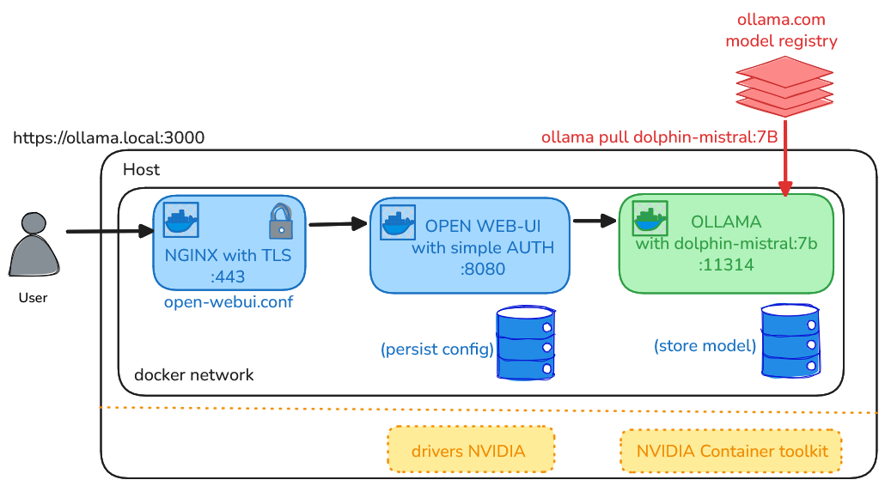

# lancement local de Ollama

## :mag_right: petite introduction à Ollama

* **GPT**: Generative Pre-trained **Transformer**
  + algorithme général de deep learning communément utilisé par les LLMs

* **LLM**: Large Language Model
  + modèle de langage basé sur l'architecture Transformer
  + entraîné sur un grand corpus de texte pour générer du texte cohérent et contextuellement pertinent

* **chatGPT**: client (chat) + llm créé par *OPENAI*

* **LLama** = LLM de *Meta*

* OLLama = *Open* LLama =  un portail public hébergeant des modèles open-source et/ou gratuit à installer

## :mag_right: Schéma de la pile de services

## :mag_right: paramètrer un modèle avec ollama

* [ici](./glossaire-parametres-ollama.md)

